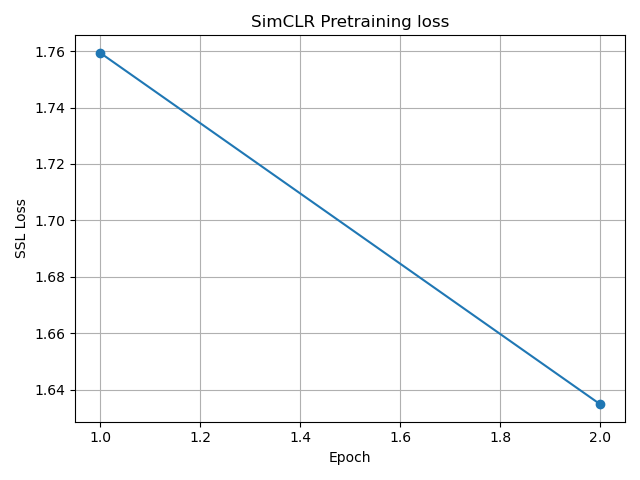

# Self-Supervised Learning — SimCLR-lite

## Abstract
We study whether contrastive self-supervised learning can produce useful visual representations on CIFAR-10 using a fixed ResNet-18 backbone. A SimCLR-style objective is used to pretrain an encoder without labels, with evaluation deferred to a downstream linear probe.

## Hypothesis
Contrastive pretraining using multiple augmented views of the same image will encourage the encoder to learn augmentation-invariant features that can later transfer to supervised tasks.

## Method
### Architecture
- Encoder: ResNet-18 (classifier removed)
- Projection head: 2-layer MLP (512 → 256 → 128)
- Output features are L2-normalized

### Augmentations
Two independent stochastic views are generated per image using:
- RandomResizedCrop
- Horizontal flip
- Color jitter
- Grayscale
- CIFAR-10 normalization

### Loss
The NT-Xent (normalized temperature-scaled cross entropy) contrastive loss is used with cosine similarity.

## Experimental Setup
- Dataset: CIFAR-10 (train split only)
- Batch size: 64
- Optimizer: AdamW
- Learning rate: 3e-4
- Temperature: 0.5
- Epochs: 2
- Compute: CPU-only

## Results
The SimCLR pretraining loss decreases consistently across epochs, indicating successful optimization of the contrastive objective.

## Interpretation
The decreasing contrastive loss suggests that the encoder learns representations that bring augmented views of the same image closer in embedding space while separating different images.

## Limitations
- Training was performed on CPU, limiting batch size and number of epochs.
- SimCLR is known to benefit from much larger batch sizes than were feasible here.
- No downstream evaluation is performed at this stage.

## Next Steps
A linear probe will be trained on top of the frozen encoder to evaluate representation quality relative to a fully supervised baseline.
