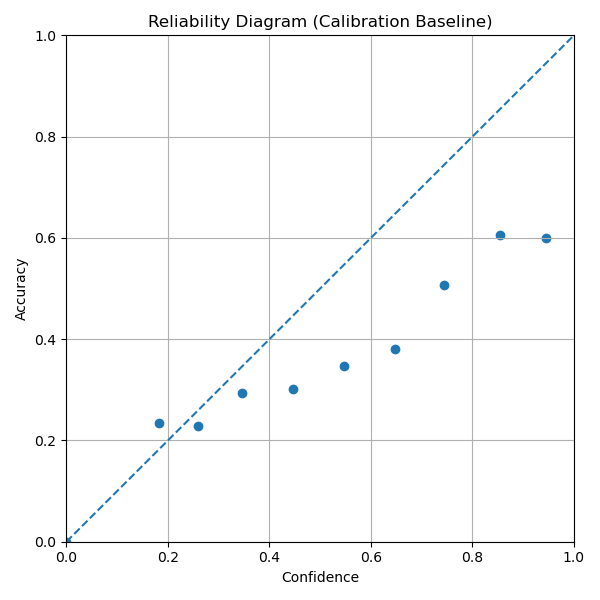

# --- Calibration Baseline on CIFAR-10 ---

## Abstract
Modern neural networks often achieve strong classification accuracy while producing calibrated confidence estimates. In safety-critical or decision making settings, confidence miscalibration can be as fatal as low accuracy. In this experiment, we evaluate the calibration behavior of a stnadrd supervised ResNet-18 trained on CIFAR-10, using confidence based reliability analysis. 

## Hypothesis
We hypothesize that the supervised ResNet-18 model is overconfident, partilculary in high-confidence predictions, such that predicted confidence exceeds empirical accuracy. 

## Setup
-- Datase: CIFAR-10 (1000 samples)
-- Model: ResNet-18 (Supervised, AdamW training)
-- Checkpoint: Best test-accuracy ckpt
-- Confidence definition: Maximum softmax probability
-- Evaluation: No test-time augmentation (weak transforms only)
-- Binning: 10 unifrom confidence bins [0,0, 1.0]
-- Metric: Expected Calibration Error (ECE)

## Results

# Reliability Diagram

Confidence vs. Empirical Accuracy

# Calibration Metrics

metric,value
accuracy,0.5220304380655288
avg_confience,0.5220304380655288
ece,0.18819473952054977
num_bins,10.0
num_samples,1000.0

## Interpretation
Despite moderate classification accuracy, the model exhibits severe miscalibration, particularly in high condience predictions. For example, predictions with 94% confidence achieved only 65% accuracy. This gap highlights that raw softmax probabilities are not reliable uncertainty estimates.

## Limitations
-- Calibration is evaluated on a 1000 sample test subset rather than full CIFAR-10 test set.
-- Confidence is defined using maximum softmax probability, which is known to be poorly     calibrated.
-- no class conditional or distributional uncertainty is modeled. 

